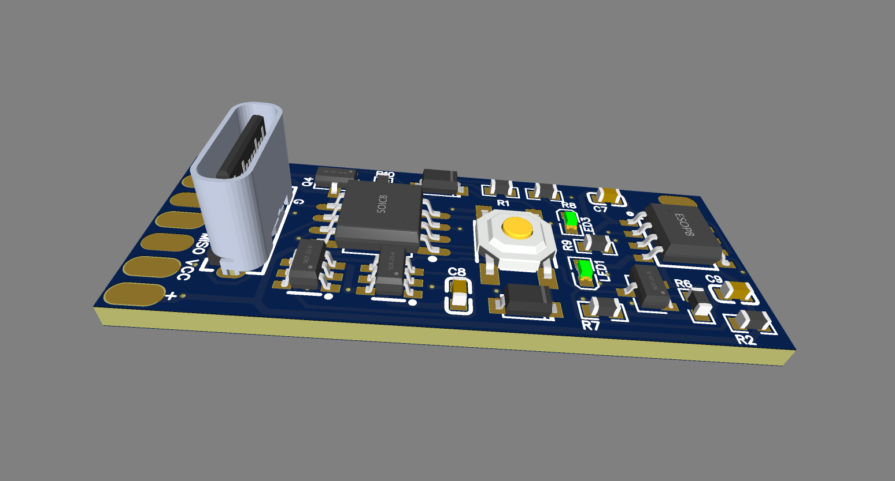
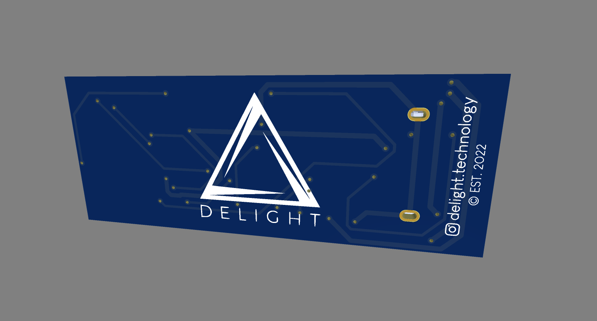

# Dog Collar
This is a project of LED Dog Collar.


## Table of contents
* [Features](#Features)
* [Technologies](#technologies)
* [Setup](#setup)

## Features
- ATTiny85 microcontroller
- TP4056 LiPo Battery Charger with LEDs indicators
- Simple One-Button user interface
- WS2812b LEDs
	
## PCB
<p float="left">
  
   
</p>

* Lorem version: 12.3
* Ipsum version: 2.33
* Ament library version: 999


### Schematics

## Setup
To run this project, install it locally using npm:

```
$ cd ../lorem
$ npm install
$ npm start
```

# header H1
## header H2
### header H3
#### header H4

## License

Copyright © 2022, [Andrzej Strzala](https://www.linkedin.com/in/andrzejstrzala/).


