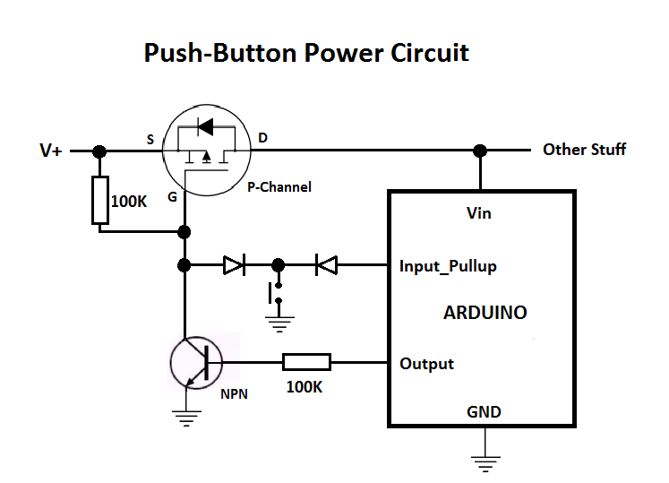
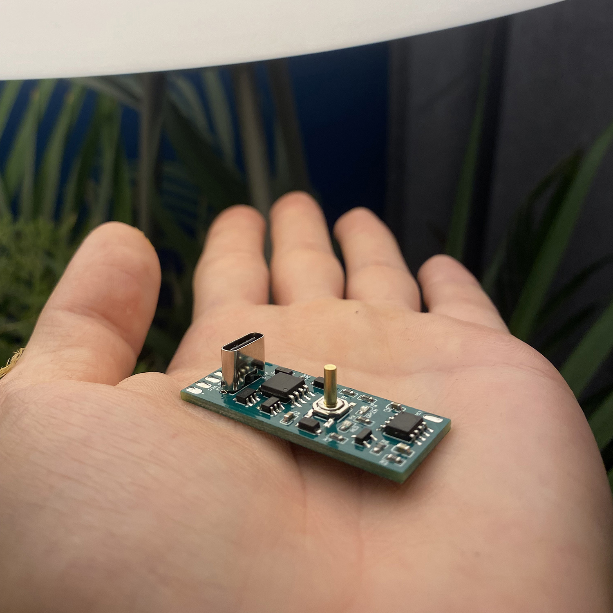

# LED Dog Collar

Here it is the 𝗗𝗲𝗹𝗶𝗴𝗵𝘁 𝗗𝗼𝗴 𝗖𝗼𝗹𝗹𝗮𝗿 **v1.0**. There are 10 colorfull patterns which can be switched by a press of a button, 11th mode cycle through each pattern every 30 sec. This project was created especially for my friend's dog called Duch (eng. Ghost).  
Inside of the enclosure there is a custom made PCB which is a WS2812B LED controller. Powered by 3.7v LiPo battery, ATTiny85 MCU with battery charging LED indicators and one button to controll them all. One click start the MCU, then you can switch animations by single click and long press turns off the controller. I reached out the limits of the memory of ATTiny85 so there is only 10 animations.  
The box was created in Fusion360. It took dozens ideas to make it work as it is now with this bending and blurring tube. At the end I decided to create a collar that is put over the dog's head as the material that diffuse leds is really stiff and unfold itself to the straight line. In general any clip fastening is marking collar shape not round. I would definitely look for another diffusing material for version 2.0.

## Table of contents
* [Features](#Features)
* [PCB](#PCB)
* [Reflow](#Reflow)
* [Modeling and 3D Printing](#modeling-and-3d-printing)
* [License](#License)

## Features
- ATTiny85 microcontroller
- TP4056 LiPo Battery Charger with LEDs indicators
- Simple One-Button user interface
- WS2812b LEDs
- Pcb dimensions: 1,5cm x 4cm
	
## PCB

  
   

The idea behind PCB was to have as small as possible LED controller with an option to charge battery and change patters. Power and charging module is pretty standart TP4056 LiPo battery charger with DW01A and FS8205 components. The chellange was to create the circut that could be turned ON and OFF without using the microcontroler (which would need to be powered all the time) but just with the usage of electronics. I managed to find below schematic which seems to be doing the job. There is also too less pins on the ATTiny85 to control the LEDs so I used DIN pad as an I/O - when you program MCU it is used as CLK, then it chanes to LED data. I used [EasyEDA](https://easyeda.com/) to create schematics.  

 

You can find more information [here](https://forum.arduino.cc/t/enhanced-mode-mosfet-to-connect-reset-to-button-when-in-deep-sleep/691669/5).

## Reflow

You can find assembly and reflow process video on Instagram: [delight.technology](https://www.instagram.com/reel/CfcdpeuFpSo/)
  

## Modeling and 3D Printing

The connector is built from three main parts: a main module containing shelves for PCB and a battery, and two components connecting the tube to the housing. Parts were printed using PTEG filament along with a button and cap made of TPU. The housing is held in place thanks to two screws, while the tube is attached using rivets.

## License

Copyright © 2022, [Andrzej Strzala](https://www.linkedin.com/in/andrzejstrzala/).

