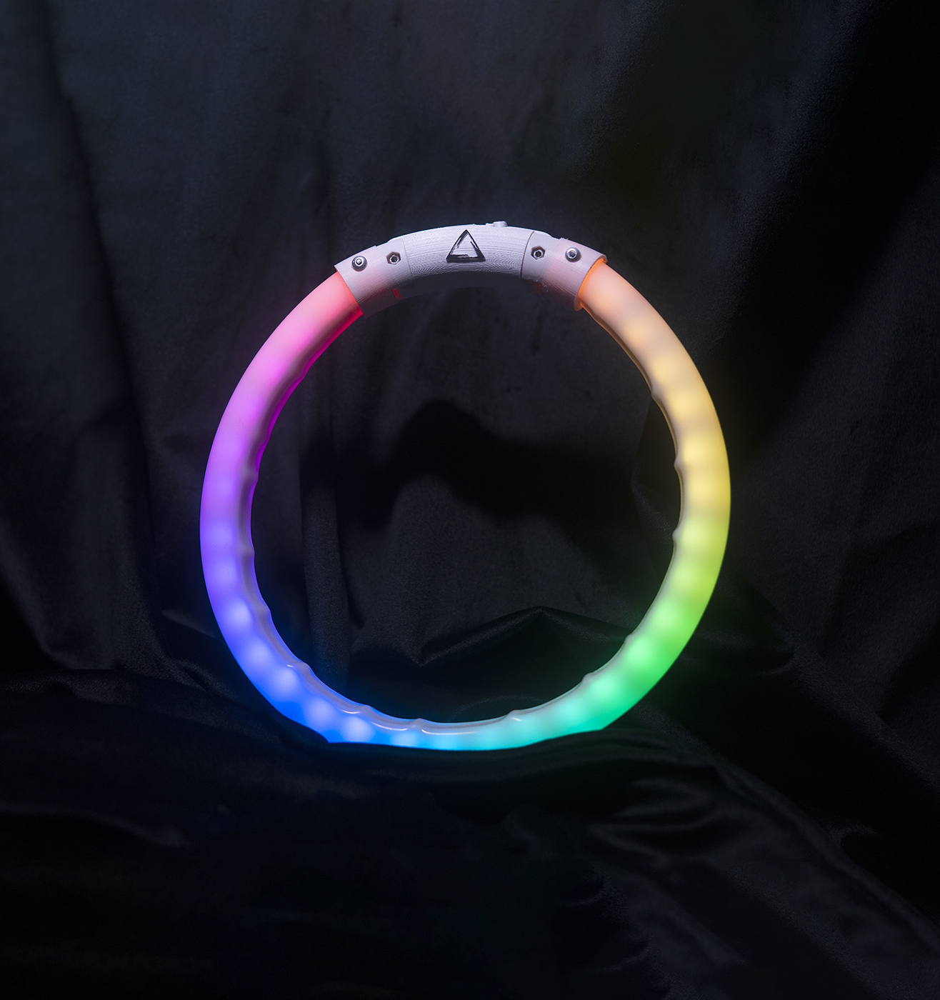

# Dog Collar
This is a project of LED Dog Collar.




# header H1
## header H2
### header H3
#### header H4

## Table of contents
* [Features](#Features)
* [Technologies](#technologies)
* [Setup](#setup)

## Features
- ATTiny85
- 1.02" 128x80 pixel Epaper display
- Onboard battery charger
- Optimized battery capacity estimation
- Simple One-Button user interface (Two optional buttons available)
- WS2812 user LED
- LiPo battery charger with indicator LED
	
## Technologies
Project is created with:
* Lorem version: 12.3
* Ipsum version: 2.33
* Ament library version: 999
	
## Setup
To run this project, install it locally using npm:

```
$ cd ../lorem
$ npm install
$ npm start
```


